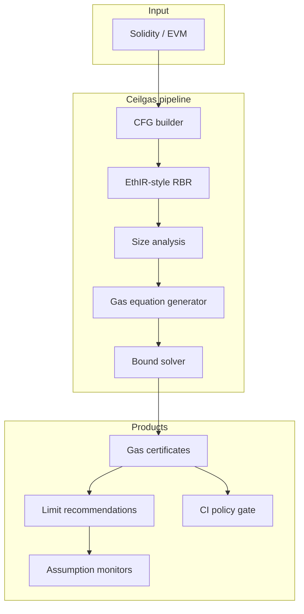

# Ceilgas

**Source:** `ai-in-decentralized+ai/research-paper_1811.10403v1/`
**Domain:** `ai-decentralized`
**One-liner:** A sound gas-upper-bound analyser for Ethereum functions that certifies safe gas limits before users or oracles submit transactions, so contracts stop freezing under out-of-gas exceptions.
**Wedge:** Protocol teams and wallet/infrastructure providers who set gas limits for complex public functions — especially those with loops over growing state (lotteries, batch claims, oracle callbacks) — where a wrong limit bricks progress or enables griefing.
**Positioning:** A certification-grade gas complexity product, not a pattern-matching bug finder. GASPER and MadMax hunt gas anti-patterns; compilers return constants or ∞. Ceilgas infers parametric opcode and memory gas upper bounds from EVM so operators can answer “how much gas is necessary to safely reach this point?” with a sound formula.

## Market research synthesis

### Thesis from source

Ethereum meters every EVM operation in gas paid by the transaction proposer. Gas fees prevent wasted miner work, deter unbounded storage growth, and cap non-terminating executions. When a transaction exceeds the user-allotted gas limit, an out-of-gas exception is raised — and an entire family of contract vulnerabilities follows from that behaviour. High-level languages (Solidity, Vyper) make static estimation hard because compilers only emit constant bounds or ∞, while Ethereum safety guidance discourages gas that depends on stored data size, inputs, or chain state. The paper’s experiments show almost 10% of analysed functions nevertheless have non-constant gas — precisely the unsafe zone.

Gastap (Gas-Aware Smart contracT Analysis Platform) is presented as the first automatic *sound* gas analyser: input Solidity or EVM, output upper bounds for every public function in terms of input sizes, contract state, and blockchain data. The pipeline extends Oyente (CFG), EthIR (rule-based IR), SACO (size relations), and Pubs (equation solving), with a carefully approximated EVM gas model splitting opcode cost and memory cost (peak resource analysis for memory expansion). On 2,517 real contracts / 8,341 public functions pulled from January 2018 chain data, Gastap inferred bounds for 97.69% of functions in 6.7 hours (~24,060s total analysis time). About 90% of functions have constant opcode/memory gas; of the ~9.5% parametric remainder, accurate opcode bounds were found for 81.84% of that subset. CFG generation failed on only 2.54% of contracts (better than Vandal’s ~5%). The EthereumPot lottery example shows how `findWinner` loops over growing `slots`/`addresses` arrays until ~25 players exhaust a 400,000 gas callback limit and the contract sticks.

Commercial applications named in the paper: developers verifying safe gas to execute a function; owners certifying progress conditions; callers provisioning enough gas for Oraclize-style callbacks; attackers estimating griefing cost (often economically impractical). The wedge product is therefore a **gas certificate** service that turns those queries into an API and CI gate.

### Buyer & economic model

- **Primary buyer:** Protocol engineering / security lead at DeFi or infrastructure teams operating stateful contracts; secondary: wallet and gas-estimation SaaS vendors who need sound ceilings rather than eth_estimateGas heuristics.
- **Users:** smart-contract developers, SRE/on-call for stuck contracts, auditor teams, wallet gas UX engineers, oracle integrators.
- **Budget owner / value metric:** protocol reliability and security budget. Value metric is percentage of public functions with certified bounds, reduction in out-of-gas production incidents, and correctness of oracle/callback gas provisioning.
- **Competing status quo:** `eth_estimateGas` on a single path, hard-coded limits, MadMax/GASPER pattern finders, and manual spreadsheet guesses that break when state grows.

### Domain constraints

- **Regulatory / trust / safety:** an unsound under-estimate that is marketed as “safe” is worse than no tool; incompleteness (“don’t-know,” ranking-function errors, timeouts) must be explicit and fail closed for certification mode.
- **Data sensitivity:** contract bytecode may be pre-launch confidential; analysis artefacts are sensitive for exploit reconnaissance if leaked before patch/redeploy plans exist.
- **Change-management realities:** bounds that grow with state require operational playbooks (migration, pagination), not just a number; teams need parametric formulas they can monitor as state metrics rise.

## Business requirements

- BR-1: For each public function analysed, the platform must return a sound opcode gas upper bound, a memory gas upper bound, or an explicit incompleteness class — never a silent under-estimate presented as safe.
- BR-2: Bounds must be expressible as constants or parametric formulas over declared size metrics (inputs, storage lengths, relevant chain values) so operators can recompute as state grows.
- BR-3: Certification mode must refuse “safe to send” when the solver returns don’t-know, ranking-function error, cover-point error, maximization error, or timeout.
- BR-4: Analysis of a contract family must complete within an SLA suitable for pre-release CI on typical contract sizes, with progress and per-function status visible.
- BR-5: Customers must be able to ask “minimum gas to safely execute function F under size assumptions S” and receive a concrete limit recommendation derived from the certified bound.
- BR-6: Oracle/callback workflows must support provisioning a recommended gas stipend for external callbacks under stated size assumptions.
- BR-7: Every certificate must bind contract bytecode hash, analyser version, EVM gas-schedule version, and assumption set for reproducibility.
- BR-8: Non-constant gas functions must be flagged as policy violations against Ethereum safety recommendations, with a severity distinct from “bound unavailable.”
- BR-9: Historical certificates remain queryable after analyser upgrades so production ops can prove what was certified at deploy time.
- BR-10: The product must distinguish certification (sound bounds) from optimisation hints; commercial packaging must not conflate the two.
- BR-11: Griefing-cost estimates, if offered, must be labelled as adversarial analytics and gated to authorised roles.
- BR-12: Success is measured by certified coverage of public functions and production out-of-gas incident rate, not by raw contracts uploaded.

## User stories

Canonical user stories live in sibling [USER_STORIES.md](USER_STORIES.md).

## System design

### Overview

Ceilgas ingests Solidity or EVM, builds a complete CFG, decompiles to a higher-level rule-based representation, infers size relations, generates opcode and memory gas equations under an approximated EVM cost model, and solves for closed-form upper bounds. Results become certificates, CI gates, and gas-limit recommendations under customer-supplied size assumptions. Monitoring hooks compare live chain metrics to those assumptions.

### Actors & boundaries

- **Actors:** developers, SREs, auditors, oracle operators, platform admins.
- **Trust boundary:** analysis runs on customer-submitted artefacts; certificates are operator-signed attestations of *what the analyser proved*, not guarantees about miner behaviour or future hard forks.
- **Human-in-the-loop points:** approving non-constant-gas exceptions; interpreting don’t-know classes; setting production size-assumption monitors.

### Core capabilities

1. **Contract ingestion and CFG build** — Solidity compile or raw EVM, CFG completeness reporting.
2. **Size-relation inference** — metrics over inputs, storage, chain data.
3. **Gas equation generation** — opcode and memory cost models.
4. **Bound solving and certification** — closed forms or typed incompleteness.
5. **Limit recommendation** — evaluate formulas under assumption sets.
6. **Policy gating** — non-constant gas and fail-closed rules in CI.
7. **Assumption monitoring** — compare live metrics to certificate assumptions.

### Conceptual data

- **Primary entities:** ContractBuild, PublicFunction, SizeMetric, GasBound, IncompletenessReport, AssumptionSet, GasCertificate, LimitRecommendation, MonitorAlert.
- **Critical events:** build analysed, bound proven, incompleteness raised, certificate issued, assumption breached, CI gate evaluated.
- **Retention / audit needs:** certificates and bound formulas retained for the life of the deployed bytecode plus dispute window; intermediate IR optional per tenant.

### Integrations (conceptual)

- **Systems of record:** compiler artefact store, Git CI, on-chain indexers for state sizes, pager systems.
- **Upstream signals:** EVM gas schedule versions, Solidity compiler releases.
- **Downstream actions:** CI fail/pass, wallet gas suggestions, oracle stipend config, ops alerts.

### High-level architecture

### Success metrics

- **Leading:** % public functions with closed-form bounds; median analysis time; don’t-know rate by error class; assumption-monitor coverage.
- **Lagging:** production out-of-gas incidents on certified functions; oracle callback success rate; time-to-detect state growth toward unsafe regions; paid workspace retention.

## OpenAPI skeleton

Canonical HTTP surface lives in sibling [openapi.yaml](openapi.yaml). Summarize here:

- **Base path:** `/v1/...`
- **Auth:** API key for CI/automation; Bearer JWT for operators
- **Resource groups:** Builds, Functions, Bounds, Certificates, Recommendations, Monitors
