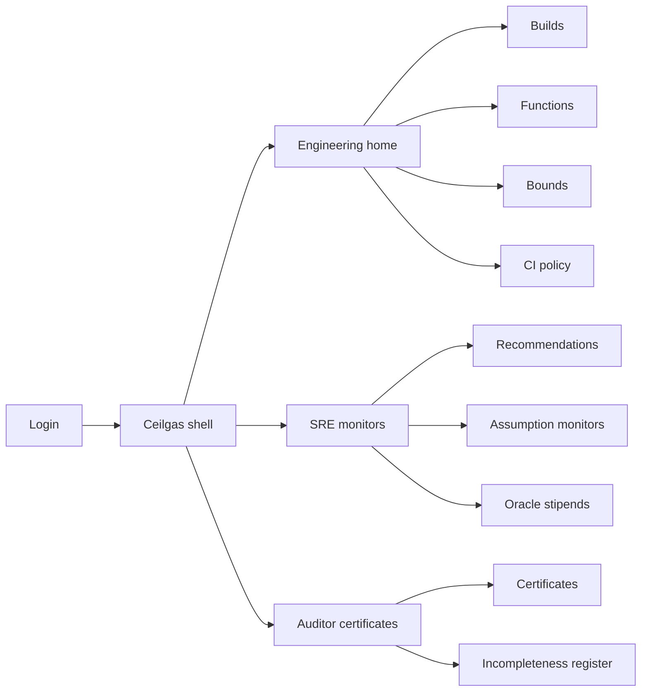
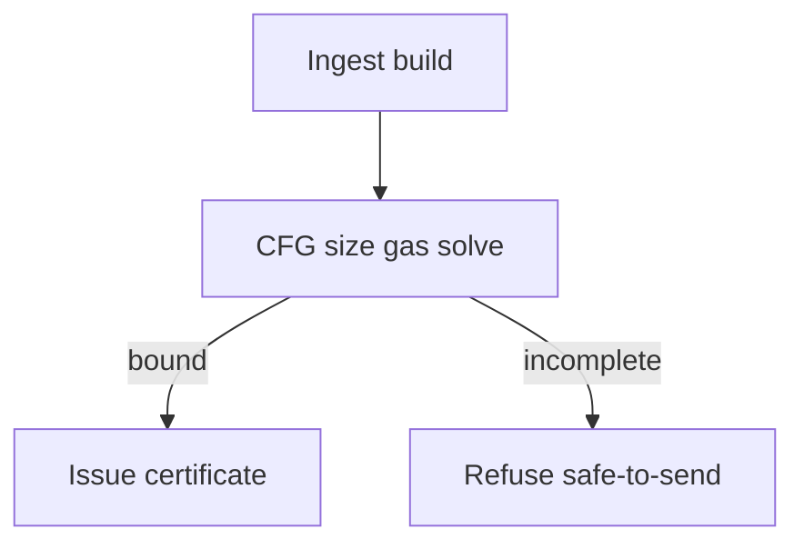
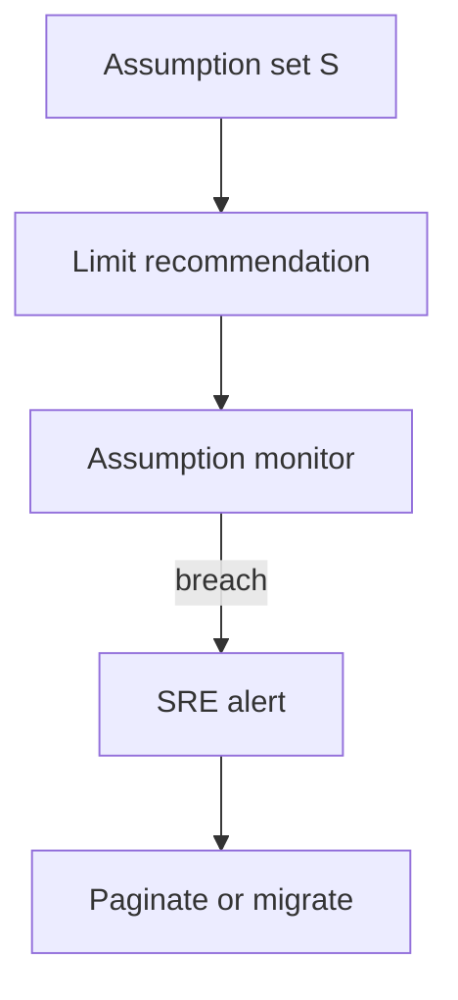

# Ceilgas — Web app

**Product:** [PRODUCT.md](./PRODUCT.md)
**Primary surface:** Gas certification console for protocol engineering, SRE, and auditors
**Secondary surfaces:** CI gate status for builds; oracle stipend calculator (embedded tool); assumption-monitor alert board
**Design thesis:** Ceilgas is a pressure gauge for EVM execution — it certifies how much gas is *necessary* to finish a public function as state grows, not a vibes-based `eth_estimateGas` guess. The metaphor is a parametric ceiling chart and stamped gas certificate: constants feel calm; loops over growing arrays feel rising pressure; don’t-know classes feel sealed unfinished. Visual language is cool boiler-room graphite with gauge-cyan and relief-amber: certified bounds feel stamped; incompleteness feels hatched; non-constant policy violations feel flagged. The wordmark sits as a quiet meter seal on every certificate-bearing screen so SREs know whose sound upper bound they are provisioning against.

## UX research synthesis

### Category peers (best-in-class)

- **Tenderly / Blockscout gas profilers:** Per-call gas breakdowns and simulation. Steal: function-level gas visibility and assumption inputs; reject single-path simulation presented as a sound ceiling.
- **eth_estimateGas wallet UX (MetaMask-class):** Concrete limit suggestion for senders. Steal: “recommended limit under assumptions S” as a primary action; reject opaque heuristic without incompleteness disclosure.
- **Certora / formal tooling completeness reporting:** Explicit don’t-know / timeout classes. Steal: typed incompleteness — never silent under-estimate as “safe”; reject binary analysed=safe.
- **Datadog / SRE burn-rate monitors:** Alert when live metrics approach assumption thresholds. Steal: assumption monitors as first-class ops objects for growing storage lengths.

### Patterns to adopt / reject

- **Adopt:** Opcode + memory bounds as formulas; size metrics declared; certification fail-closed on don’t-know; CI policy on non-constant gas; bytecode/analyser/gas-schedule binding on certificates; oracle callback stipend workflow; griefing estimates role-gated and labelled adversarial; distinguish certification vs optimisation hints.
- **Reject:** MadMax-style pattern bingo as the only home; ∞ bounds marketed as fine; silent under-estimates; conflating optimiser tips with certificates; purple AI; griefing tools for all roles.

### Trust, density, and workflow constraints from PRODUCT.md

Every public function returns sound opcode/memory upper bound or typed incompleteness — never silent unsafe under-estimate (BR-1). Parametric formulas over size metrics (BR-2). Certification refuses safe-to-send on don’t-know classes (BR-3). CI SLA with per-function progress (BR-4). Limit recommendation under assumptions S (BR-5). Oracle stipend support (BR-6). Certificate binds bytecode, analyser, gas-schedule, assumptions (BR-7). Non-constant flagged vs Ethereum safety guidance (BR-8). Historical certificates after upgrades (BR-9). Certification ≠ optimisation packaging (BR-10). Griefing role-gated (BR-11). Success = coverage + OOG incident rate (BR-12).

## Information architecture

### Nav model

### Roles → default home

| Role | Default home | Why |
|------|--------------|-----|
| Smart-contract developer | Builds / functions | Parametric bounds post-compile |
| Protocol SRE | Assumption monitors | State growth toward unsafe region |
| Oracle integrator | Oracle stipends | Certified callback gas |
| Security auditor | Incompleteness register | Residual risk documented |
| Platform admin | Analyser / schedule pins | No silent schedule drift |

### Cross-links to OpenAPI resources

| Nav area | OpenAPI tags / resources |
|----------|---------------------------|
| Contract builds / CFG | Builds |
| Public functions / size metrics | Functions |
| Opcode & memory bounds | Bounds |
| Gas certificates | Certificates |
| Limits under assumptions | Recommendations |
| Live assumption breach | Monitors |

## Screen inventory

### Engineering home

- **Purpose:** Answer “which public functions are certified, parametric, or incomplete — before we ship?”
- **Entry:** Developer login.
- **Layout regions:** Brand meter seal; coverage % certified; non-constant policy flags; incompleteness counts by class; analysis progress.
- **Primary actions:** Open build; run analysis; export coverage.
- **Empty / loading / error:** Empty = upload first build; CFG fail called out (not hidden).
- **BR / story ties:** BR-1, BR-4, BR-8, BR-12.

### Build analysis

- **Purpose:** Ingest Solidity/EVM, show CFG completeness, run bound pipeline within CI SLA.
- **Entry:** Builds nav; CI deep link.
- **Layout regions:** Build identity (bytecode hash); analyser + gas-schedule versions; per-function status table; progress; certification vs optimisation tab split.
- **Primary actions:** Analyse; pin versions; open function.
- **Empty / loading / error:** Timeout = incompleteness class, not fake bound.
- **BR / story ties:** BR-4, BR-7, BR-10.

### Function bound detail

- **Purpose:** Show opcode and memory upper bounds as constants or parametric formulas with size metrics.
- **Entry:** Functions table.
- **Layout regions:** Formula pane; size metric declarations; incompleteness panel if any; non-constant policy badge; EthereumPot-style growth narrative when loops over storage.
- **Primary actions:** Evaluate under assumptions; create certificate; open monitor.
- **Empty / loading / error:** Don’t-know hatched — no “safe” stamp.
- **BR / story ties:** BR-1, BR-2, BR-3, BR-8.

### Limit recommendation

- **Purpose:** Answer “minimum gas to safely execute F under size assumptions S.”
- **Entry:** Function detail; SRE recs.
- **Layout regions:** Assumption set editor; derived limit; safety margin policy; copy for wallet/oracle config.
- **Primary actions:** Save assumption set; recommend; push to monitor.
- **Empty / loading / error:** Missing bound = cannot recommend in certification mode.
- **BR / story ties:** BR-5.

### Oracle callback stipend

- **Purpose:** Provision certified gas stipend for `__callback`-style entrypoints under stated sizes.
- **Entry:** Oracle nav; integrator home.
- **Layout regions:** Entrypoint selector; assumption set; stipend recommendation; deploy config export.
- **Primary actions:** Issue stipend config; link certificate.
- **Empty / loading / error:** Incomplete bound = fail closed.
- **BR / story ties:** BR-6; oracle integrator stories.

### CI policy gate

- **Purpose:** Fail CI on non-constant gas without approved exception; refuse certification on incompleteness.
- **Entry:** Project policy.
- **Layout regions:** Rules (non-constant severity, fail-closed incompleteness); exception dual-note; mode badge (certification vs hints).
- **Primary actions:** Save policy; approve exception.
- **Empty / loading / error:** Policy conflict shown inline.
- **BR / story ties:** BR-3, BR-8, BR-10.

### Assumption monitors

- **Purpose:** Alert when live chain metrics approach certificate size assumptions before OOG.
- **Entry:** SRE home.
- **Layout regions:** Monitor list; live vs assumed metrics; proximity gauge; alert history; pagination/migration playbook link.
- **Primary actions:** Create monitor; ack alert; recompute recommendation.
- **Empty / loading / error:** Empty = CTA to attach certificate assumptions.
- **BR / story ties:** BR-5, BR-9; SRE stories.

### Gas certificate viewer

- **Purpose:** Bind bytecode hash, analyser version, gas-schedule version, assumption set — reproducible forever.
- **Entry:** Auditor; build certify action.
- **Layout regions:** Certificate body; bindings; formulas snapshot; historical query after upgrades.
- **Primary actions:** Issue; download; verify.
- **Empty / loading / error:** Incomplete functions listed — certificate may be partial with explicit gaps.
- **BR / story ties:** BR-7, BR-9; auditor stories.

### Incompleteness register

- **Purpose:** Itemise don’t-know, ranking-function, cover-point, maximization, timeout per function.
- **Entry:** Auditor default secondary; engineering home drill.
- **Layout regions:** Class taxonomy table; residual risk notes; no “analysed = safe” collapse.
- **Primary actions:** Export residual risk; link to tickets.
- **Empty / loading / error:** Empty = full closed-form coverage message.
- **BR / story ties:** BR-1, BR-3; auditor stories.

### Griefing-cost estimate (gated)

- **Purpose:** Adversarial analytics of griefing cost — labelled and role-gated.
- **Entry:** Authorised security role only.
- **Layout regions:** Estimate; adversarial analytics banner; access audit log.
- **Primary actions:** Run estimate; export to authorised case file.
- **Empty / loading / error:** Unauthorised = access denied, no soft hide of numbers in URL.
- **BR / story ties:** BR-11.

## Key flows

1. **Certify public functions** — ingest build → analyse → bounds or incompleteness → certificate; failure: don’t-know refuses safe-to-send.

2. **Provision under growth** — set assumptions S → recommend limit → monitor live metrics → alert before OOG.

3. **Oracle stipend** — select callback → assumptions → certified stipend → config export (BR-6).

4. **CI non-constant policy** — detect parametric gas → fail or approved exception (BR-8).

5. **Historical prove-out** — after analyser upgrade, query prior certificate bindings for deploy-time proof (BR-9).

## Design system

### Tokens (CSS variables)

- `--color-ink: #E7EDF2` — text
- `--color-boiler-950: #0B1014` — ground
- `--color-boiler-900: #141B22` — panels
- `--color-boiler-700: #2A3540` — rules
- `--color-gauge: #3AA7C9` — certified / brand cyan-steel
- `--color-gauge-dim: #1F5F73`
- `--color-pressure: #E0A53A` — parametric rising / monitor proximity
- `--color-incomplete: #8B7B6B` — hatched don’t-know
- `--color-flag: #D4544A` — non-constant policy / OOG risk
- `--color-mute: #8A96A3`
- `--font-display: "Sora", sans-serif` — gauge titles
- `--font-body: "IBM Plex Sans", sans-serif`
- `--font-mono: "IBM Plex Mono", monospace` — formulas, hashes, gas integers
- `--space-1`…`--space-8`: 4px scale
- `--radius-sm: 2px`; `--radius-md: 6px`
- `--motion-gauge: 240ms ease-out` — pressure needle
- `--motion-stamp: 160ms ease-out` — certificate stamp
- `--motion-hatch: 200ms linear` — incompleteness hatch
- Atmosphere: boiler-room hatch and fine meter ticks — gas as pressure, not neon crypto; no purple; no cream-terracotta; no broadsheet.

### Typography & brand

- Sora for function names and limits; mono for formulas and gas numbers.
- Ceilgas wordmark on every certificate- and monitor-bearing view.
- Login: brand + “How much gas is necessary?” + one CTA.

### Do / don’t

- **Do:** Show formulas; hatch incompleteness; bind schedule versions; separate certification from optimisation; gate griefing.
- **Don’t:** Silent under-estimates; ∞ as green; eth_estimateGas as the certificate; purple AI; ungated adversarial tools.

### Accessibility & domain trust cues

- Pressure/flag never colour-only.
- Live regions for monitor breaches.
- Focus: function → bound → recommend → monitor → certificate.
- Certificates machine-verifiable bindings.

## Component patterns

- **GasFormulaPane** — opcode/memory parametric bound display.
- **IncompletenessHatch** — typed don’t-know classes.
- **AssumptionSetEditor** — size metrics for evaluation.
- **LimitRecommendation** — concrete gas under S.
- **CertificateBindingHeader** — bytecode + analyser + schedule + assumptions.
- **NonConstantPolicyFlag** — distinct from incompleteness.
- **AssumptionProximityGauge** — live vs assumed metrics.
- **OracleStipendConfig** — callback gas export.
- **GriefingEstimateGate** — role-gated adversarial analytics.

## Out of scope for v1 web

- Wallet custody; full MadMax anti-pattern suite as primary; miner fee markets; replacing `eth_estimateGas` in every wallet; L2 fee abstraction; attack automation for unprivileged users; Solidity IDE.
